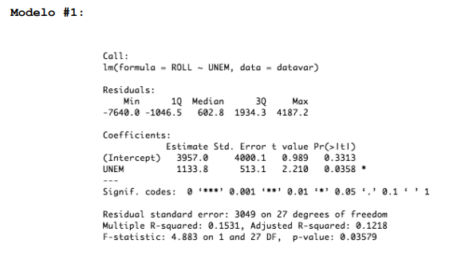
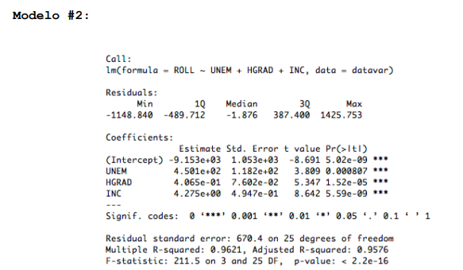
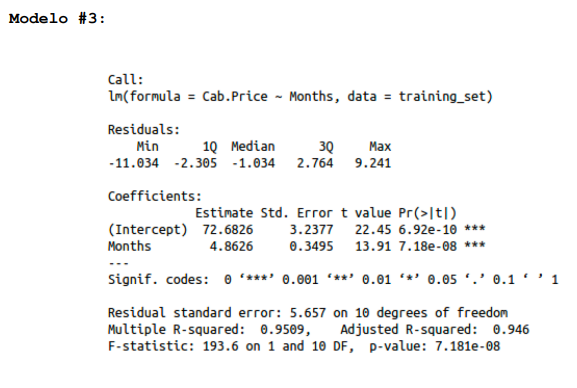

```{r include=FALSE}
library(dplyr)
library(ggplot2)
library(caret)
library(PerformanceAnalytics)
```
# Ejercicio 1

Utilizando R realice una función que dado un dataframe
cualquiera de dos columnas, donde la primera (índice 1) sea el valor de
la variable independiente (X) y la segunda sea el valor de una variable
dependiente (Y), devuelva una lista con los siguientes elementos:

## 1) Un arreglo con lo valores de los estimadores para $B_0$ y $B_1$

```{r}
calculate_estimators <- function(df) {
  x <- df[, 1]
  y <- df[, 2]
  n <- length(x)

  num_b1 <- (sum(x) * sum(y) - n * (sum(x * y)))
  denominator_b1 <- ((sum(x)^2) - n * sum(x^2))
  b1 <- num_b1 / denominator_b1

  num_b0 <- (sum(y) - b1 * (sum(x)))
  b0 <- num_b0 / length(x)

  result <- list(B_0 = b0, B_1 = b1)
  return(result)
}


calculate_r_squared <- function(df, estimators) {
  x <- df[, 1]
  y <- df[, 2]

  y_pred <- estimators$B_0 + estimators$B_1 * x

  mean_y <- mean(y)


  r_squared_num <- sum((y_pred - mean_y)^2)
  r_squared_den <- sum((y - mean_y)^2)
  s <- y - mean_y
  r2 <- r_squared_num / r_squared_den

  return(r2)

}

calculate_r <- function(r2) {
  return(sqrt(r2))
}

calculate_residuals <- function(df, estimators) {
  x <- df[, 1]
  y <- df[, 2]

  y_pred <- estimators$B_0 + estimators$B_1 * x

  residuals <- y - y_pred

  return(y_pred)
}

```


```{r}
randomDf <- data.frame(
  X = c(3, 4, 5, 7, 8),
  Y = c(2, 4, 5, 4, 5)
)

estimators <- calculate_estimators(randomDf)
print(estimators)
```

```{r}
model <- lm(randomDf[, 2] ~ randomDf[, 1])
summary(model)
```

## 2) El valor del coeficiente de determinación $r^2$ del modelo.

```{r}
r2 <- calculate_r_squared(randomDf, estimators)
print(r2)
```

## 3) El coeficiente de correlación r (raíz cuadrada de $r^2$)
```{r}
r_coef <- calculate_r(r2)
print(r_coef)
```


## 4) Un arreglo con los valores de los residuos

```{r}
residuals <- calculate_residuals(randomDf, estimators)

print(residuals)
```
## 5) Una gráfica con la nube de puntos y la recta de regresión del modelo
```{r}
regression_line <- function(df, estimators) {
  x_seq <- seq(min(df[, 1]), max(df[, 1]), length.out = 100)

  y_pred <- estimators$B_0 + estimators$B_1 * x_seq

  regressionLine <- data.frame(X = x_seq, Y = y_pred)

  return(regressionLine)
}

regressionLine <- regression_line(randomDf, estimators)

regressionLinePlot <- ggplot(randomDf, aes(x = X, y = Y)) +
        geom_point(color = "blue", size=3) +
        geom_line(data = regressionLine, aes(x = X, y = Y), color = "red", size = 1) +
        labs(title = "Nube de puntos y linea de regresión",
             x = "X",
             y = "Y"
        ) +
        theme_minimal()

print(regressionLinePlot)

```

# Ejercicio 2

## 1. Realice un análisis estadístico sobre todas las variables del dataset, recuerde que pude usar la función summary().

```{r}
admissionsDatasetPath <- "Admisions.csv"

admissionsDf <- read.csv(admissionsDatasetPath)

head(admissionsDf)
```

```{r}
summary(admissionsDf)
```

Podemos notar que no todas las variables tienen la misma escala, unas tienes valores mucho más bajos que otros, este tipo de condiciones
puede llevar a problemas de entrenamiento en el modelo, porque puede asignarle mayor importancia a algunas variables que no tienen tanta relevancia, deberiamos llevarlos todos a una misma escala.

## 2. Realice una gráfica de densidad para cada una de las variables numéricas en el dataset: GRE.Score, TOEFEL.Score, CGPA y Chance of Admit

```{r}
plotColumn <- function(data, x_axis, title, x_lab, y_lab) {
  plottedDensity <- ggplot(data, aes(x = x_axis)) + 
  geom_density(fill = "blue", alpha = 0.5) +
  labs(title = title, x = x_lab, y = y_lab)
  
  return(plottedDensity)
}
```


### Gráfica de densidad GRE Score

```{r}
plotColumn(admissionsDf, admissionsDf$GRE.Score, "Densidad de GRE Score", x_lab="GRE Score", y_lab = "Densidad")
```

### Gráfica de densidad de TOEFEL Score

```{r}
plotColumn(admissionsDf, admissionsDf$TOEFL.Score, "Densidad de TOEFEL.Score", x_lab = "TOEFEL Score", "Densidad")
```

### Gráfica de densidad de CGPA

```{r}
plotColumn(admissionsDf, admissionsDf$CGPA, "Densidad de CGPA", x_lab = "CGPA", y_lab = "Densidad")
```

### Gráfica de densidad de Chance of Admit

```{r}
plotColumn(admissionsDf, admissionsDf$Chance.of.Admit, "Densidad de Chance of Admit", x_lab = "Chance of Admit", y_lab = "Densidad")
```

## 3. Realice una gráfica de correlación entre las variables del inciso 
anterior

```{r}
columnsToPlotDf <- admissionsDf %>%
  select(GRE.Score, TOEFL.Score, CGPA, Chance.of.Admit)


chart.Correlation(columnsToPlotDf, histogram = TRUE, method = "pearson")
```


## 4. Realice comentarios sobre el análisis estadístico de las variable numéricas y la gráfica de correlación

Podemos ver que exista una alta correlación entre las variables, pero la que mejor predice el chance de admisión es la de CGPA.
Todas las correlaciones son positivas y podemos que casi tienen una distribucón normal.

## 5. Realice un scatter plot (nube de puntos) de todas las variables  numéricas contra la variable Chance of Admit

```{r}
scatterPlotGenerator <- function(data, x, y, title, x_lab, y_lab) {
  
  scatterPlot <- ggplot(data, aes(x = x, y = y)) + 
  geom_point(alpha = 0.5) +
  geom_smooth(method = "lm", se = TRUE, color = "blue") +
  labs(title = title, x = x_lab, y = y_lab) +
  theme_minimal()
  return(scatterPlot)
}
```

```{r}
scatterPlotGenerator(
  admissionsDf,
  x = admissionsDf$GRE.Score,
  y = admissionsDf$Chance.of.Admit,
  title = "GRE Score vs Chance of admit",
  x_lab = "GRE Score",
  y_lab = "Chance of admit"
)
```
```{r}
scatterPlotGenerator(
  admissionsDf,
  x = admissionsDf$TOEFL.Score,
  y = admissionsDf$Chance.of.Admit,
  title = "TOEFL Score vs Chance of admit",
  x_lab = "TOEFL Score",
  y_lab = "Chance of admit"
)
```
```{r}
scatterPlotGenerator(
  admissionsDf,
  x = admissionsDf$CGPA,
  y = admissionsDf$Chance.of.Admit,
  title = "CGPA vs Chance of admit",
  x_lab = "CGPA",
  y_lab = "Chance of admit"
)
```

## 6. Utilizando la función train y trainControl para crear un cross-validation y le permita evaluar los siguientes modelos

```{r}
createLrModel <- function(data, formula) {
  train_control <- trainControl(method = "cv", number = 10)

  lr_model <- train(formula, data = data, method = "lm", trControl = train_control)
  
  return(lr_model)
}

chanceOfAdmit <- "Chance.of.Admit"
```

### Chance of Admit ~ TOEFEL.Score.

```{r}
toefl_model <- createLrModel(admissionsDf, as.formula("Chance.of.Admit ~ TOEFL.Score"))

print(toefl_model)
summary(toefl_model)

```
### Chance of Admit ~ CGPA.
```{r}
cgpa_model <- createLrModel(admissionsDf, as.formula("Chance.of.Admit ~ CGPA"))
print(cgpa_model)
summary(cgpa_model)
```

### Chance of Admit ~ GRE.Score.
```{r}
greScore_model <- createLrModel(admissionsDf, as.formula("Chance.of.Admit ~ GRE.Score"))
print(greScore_model)
summary(greScore_model)
```

### Chance of Admit ~ TOEFEL.Score + CGPA.
```{r}
toeflCgpaModel <- createLrModel(admissionsDf, as.formula("Chance.of.Admit ~ TOEFL.Score + GRE.Score"))
print(toeflCgpaModel)
summary(toeflCgpaModel)
```

### Chance of Admit ~ TOEFEL.Score + GRE.Score.
```{r}
toeflGreScore <- createLrModel(admissionsDf, as.formula("Chance.of.Admit ~ TOEFL.Score + GRE.Score"))
print(toeflGreScore)
summary(toeflGreScore)
```
### Chance of Admit ~ GRE.Score + CGPA.
```{r}
greCgpaModel <- createLrModel(admissionsDf, as.formula("Chance.of.Admit ~ GRE.Score + CGPA"))
print(greCgpaModel)
summary(greCgpaModel)
```

### Chance of Admit ~ TOEFEL.Score + CGPA + GRE.Score.
```{r}
toeflCgpaGre <- createLrModel(admissionsDf, as.formula("Chance.of.Admit ~ TOEFL.Score + CGPA + GRE.Score"))
print(toeflCgpaGre)
summary(toeflCgpaGre)
```

Posteriormente cree una lista ordenando de mejor a peor cual es el 
mejor modelo en predicción, recuerde que es necesario caclular el 
RMSE para poder armar correctamente la lista. 


```{r}
rmseToeflModel <- toefl_model$results$RMSE
rmseCgpaModel <- cgpa_model$results$RMSE
rmseGreModel <- greScore_model$results$RMSE
rmseToeflCgpa <- toeflCgpaModel$results$RMSE
rmsetoeflGre <- toeflGreScore$results$RMSE
rmseGreCgpa <- greCgpaModel$results$RMSE
rmsetoeflCgpaGre <- toeflCgpaGre$results$RMSE


modelResults <- data.frame(
  Model = c(
    "Chance of Admit ~ TOEFEL.Score",
    "Chance of Admit ~ CGPA",
    "Chance of Admit ~ GRE.Score",
    "Chance of Admit ~ TOEFEL.Score + CGPA",
    "Chance of Admit ~ TOEFEL.Score + GRE.Score",
    "Chance of Admit ~ GRE.Score + CGPA",
    "Chance of Admit ~ TOEFEL.Score + CGPA + GRE.Score"
    ),
  RMSE = c(
    rmseToeflModel,
    rmseCgpaModel,
    rmseGreModel,
    rmseToeflCgpa,
    rmsetoeflGre,
    rmseGreCgpa,
    rmsetoeflCgpaGre
  )
)

print(modelResults)
```
# Ejercicio 3

A continuación se le muestran tres imágenes que muestran los 
resultados obtenidos de correr la función summary() a dos modelos de 
regresión lineal, para este ejercicio se le solicita que realice la 
interpretación de las tablas resultantes. Recuerde tomar en cuenta la 
signficancia de los parámetros (signfícancia local), la signficancia del 
modelo (signficancia global), el valor del $r^2$: y cualquier observación que 
considere relevante para determinar si el modelo estructuralmente es 
adecuado o no

## Modelo 1



El modelo 1 presenta el peor rendimiento de los 3, se puede ver que la significancia de las variables es irrelevante, el R^2 indica que no se ajusta tan bien a los datos y su rendimiento general a través del F statistic es muy bajo, este modelo no debe ser tomaod en cuenta.

## Modelo 2



Podemos apreciar que este modelo es el que tiene el mejor rendimiento para predecir ROLL al tomar en cuenta todas las variables podemos ver que existe un significancia entre todas las variables, lo cuál nos indica que estas tienen una relación importante para poder predecir la variable ROLL, tiene un $R^2$ alto lo cual dice que tiene buen ajuste con los datos y un F statistic alto que indica que tendrá un buen desempeño general, habría que poner a prueba el desempeño del modelo contra los datos de validación para asegurarnos que no hay overfitting por tener un $R^2$ tan alto.


## Modelo 3



El modelo 3 tiene un buen desempeño al tener un $R^2$ alto lo cual indica que hay buen ajuste de los valores, los valores tienen una significancia alta lo cual indica que hay una buena relación entre las variables para poder predecir el precio del taxi, por último tenemos un F statistic alto que indica un buen rendimiento general.


